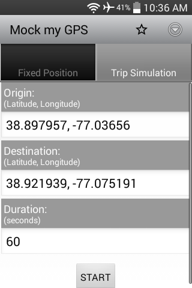

#### [Mock my GPS](https://github.com/warren-bank/Android-Mock-Location)

Android app that mocks the GPS and Network location providers.

#### Screenshots

#### Summary

combination of:

* [FakeTraveler](https://github.com/mcastillof/FakeTraveler)
* [FakeGPS](https://github.com/xiangtailiang/FakeGPS)

#### Notes

* minimum supported version of Android:
  * Android 1.5 (API level 3)

- - - -

#### Comparison of features in existing apps

__FakeTraveler__:

* pros:
  - doesn't require root or system permissions
    * only requires setting: `Developer > Mock Location`
  - includes a minimalist map embedded in a webview
    * nice implementation
    * static html page w/ 2-way javascript binding
* cons:
  - no bookmarks
  - no geo intent filters
  - no ability to "wander" from specified lat/lon

__FakeGPS__:

* pros:
  - coding is excellent
  - supports 2 ways to "wander" from specified lat/lon
    1) buttons (up, down, left, right) that apply a specified offset to current location
       * accessed via a "joystick" that floats on top of other apps
    2) "fly to"
       * user specifies a 2nd location and how much time it should take to travel there (as the crow flies)
       * recalculates a new intermediate position every 1 second
  - supports bookmarking geo coordinates
* cons:
  - requires root
  - requires installation as a system app
  - does _NOT_ use the 'Mock Location' API
    * hooks directly into low-level APIs
  - "joystick" overlay is not optional
    * always visible when GPS location is _fake_
  - "joystick" overlay includes unnecessary buttons
  - bookmarks cannot be edited
  - no good way to push a geo coordinate into the app
    * no internal webview with map
    * no geo intent filters

- - - -

#### Design Goals

Combine the best features from all:

__FakeTraveler__:

* methodology for mocking location (GPS and Network)

__FakeGPS__:

* overall architecture
* "joystick" and "fly to"

__OsmAnd__:

* geo intent filters

__other considerations__:

* though the embedded map in __FakeTraveler__ is elegant
  - the geo intent filters make this unnecessary
    * external mapping software can provide better features
      - __Google Maps__ can work offline
      - __OsmAnd__ can work offline
      - __OsmAnd__ can broadcast geo intents

__other enhancements__:

* better bookmarks
  - save from fields in UI
  - save from geo intent
  - add from dialog
  - edit from list
* more preferences
  - frequency at which location providers receive mock updates
  - duration for which mock updates are sent to location providers each time the "start" button is pressed
    * `0` holds the special meaning that the duration is indefinite and will continue until the "stop" button is pressed
  - ability to enable/disable "joystick"
  - ability to configure the increment value added to lat/lon values each time a "joystick" button is pressed
  - ability to continue to mock the destination after a trip simulation completes

- - - -

#### Legal:

* copyright: [Warren Bank](https://github.com/warren-bank)
* license: [GPL-2.0](https://www.gnu.org/licenses/old-licenses/gpl-2.0.txt)
