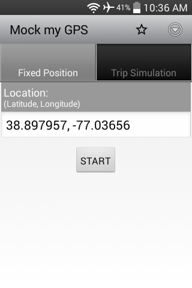
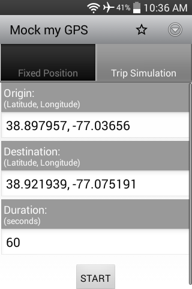
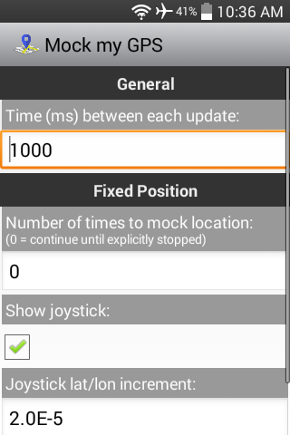
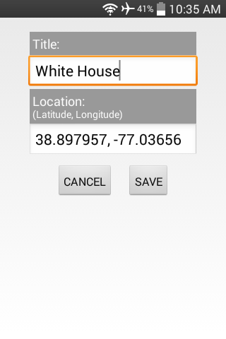
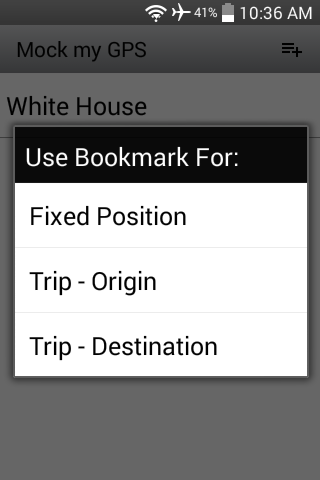

#### [Mock my GPS](https://github.com/warren-bank/Android-Mock-Location)

Android app that mocks the GPS and Network location providers.

#### Screenshots

#### Summary

combination of:

* [FakeTraveler](https://github.com/mcastillof/FakeTraveler)
* [FakeGPS](https://github.com/xiangtailiang/FakeGPS)

- - - -

#### Comparison of features in existing apps

__FakeTraveler__:

* pros:
  - doesn't require root or system permissions
    * only requires setting: `Developer > Mock Location`
  - includes a minimalist map embedded in a webview
    * nice implementation
    * static html page w/ 2-way javascript binding
* cons:
  - no bookmarks
  - no geo intent filters
  - no ability to "wander" from specified lat/lon

__FakeGPS__:

* pros:
  - coding is excellent
  - supports 2 ways to "wander" from specified lat/lon
    1) buttons (up, down, left, right) that apply a specified offset to current location
       * accessed via a "joystick" that floats on top of other apps
    2) "fly to"
       * user specifies a 2nd location and how much time it should take to travel there (as the crow flies)
       * recalculates a new intermediate position every 1 second
  - supports bookmarking geo coordinates
* cons:
  - requires root
  - requires installation as a system app
  - does _NOT_ use the 'Mock Location' API
    * hooks directly into low-level APIs
  - "joystick" overlay is not optional
    * always visible when GPS location is _fake_
  - "joystick" overlay includes unnecessary buttons
  - bookmarks cannot be edited
  - no good way to push a geo coordinate into the app
    * no internal webview with map
    * no geo intent filters

- - - -

#### Design Goals

Combine the best features from all:

__FakeTraveler__:

* methodology for mocking location (GPS and Network)

__FakeGPS__:

* overall architecture
* "joystick" and "fly to"

__OsmAnd__:

* geo intent filters

__other considerations__:

* though the embedded map in __FakeTraveler__ is elegant
  - the geo intent filters make this unnecessary
    * external mapping software can provide better features
      - __Google Maps__ can work offline
      - __OsmAnd__ can work offline
      - __OsmAnd__ can broadcast geo intents

__other enhancements__:

* better bookmarks
  - save from fields in UI
  - save from geo intent
  - add from dialog
  - edit from list
* more preferences
  - frequency at which location providers receive mock updates
  - duration for which mock updates are sent to location providers each time the "start" button is pressed
    * `0` holds the special meaning that the duration is indefinite and will continue until the "stop" button is pressed
  - ability to enable/disable "joystick"
  - ability to configure the increment value added to lat/lon values each time a "joystick" button is pressed
  - ability to continue to mock the destination after a trip simulation completes

- - - -

#### Comparison of [release](https://github.com/warren-bank/Android-Mock-Location/releases) APK variations

* `Mock-my-GPS` vs. `Mock-my-GPS-UnifiedNlp-Backend` vs. `Mock-Silently`
  - `Mock-my-GPS`
    * installation is required
    * minimum supported version of Android: 1.6 (Donut, API 4)
    * standalone application
  - `Mock-my-GPS-UnifiedNlp-Backend`
    * installation is optional
    * minimum supported version of Android: 2.3 (Gingerbread, API 9)
    * backend plugin for [UnifiedNlp](https://github.com/microg/UnifiedNlp), which is:
      - typically installed as a component of [microG](https://microg.org/)
      - intended for used on de-Googled Android ROMs
      - a drop-in replacement for Google Location Services (GLS)
    * behavior:
      - while `Mock-my-GPS` is running, `Mock-my-GPS-UnifiedNlp-Backend` provides mocked location data to `UnifiedNlp`
      - by default, the timestamp for mocked location data updates is advanced by 45 seconds
        * this causes `UnifiedNlp` to prioritize the mocked location data, and to effectively ignore location data updates provided by all other backend plugins
    * for more info, refer to:
      - [XDA forum](https://forum.xda-developers.com/t/app-unifiednlp-floss-wi-fi-and-cell-tower-based-geolocation.2991544/)
  - `Mock-Silently`
    * installation is optional
    * minimum supported version of Android: 1.0 (API 1)
    * standalone application
    * purpose:
      - to intercept implicit geo-Intents that originate from 3rd-party software, and cannot be directly configured to include custom extras
    * behavior:
      - add pre-configured values for custom extras to intercepted geo-Intents
      - make the updated geo-Intent explicit to open in `Mock-my-GPS`
      - start the updated geo-Intent
      - finish without ever showing any visible UI
    * recommendation:
      - while using 3rd-party software to share locations with `Mock-my-GPS` through implicit geo-Intents, make this the default app to handle implicit geo-Intents
      - when done, revoke this Android setting to re-enable the Activity chooser
* `english` vs. `withAllLanguageTranslations`
  - `english`
    * does not include translated string resources for any other languages
  - `withAllLanguageTranslations`
    * does include translated string resources for all supported languages
* `withAospLocationProviders` vs. `withGooglePlayServicesFusedLocationProvider` vs. `withHuaweiMobileServicesFusedLocationProvider`
  - `withAospLocationProviders`
    * supplies mock location data to the following _Android Open Source Project_ (AOSP) location providers:
      - `LocationManager.GPS_PROVIDER`
      - `LocationManager.NETWORK_PROVIDER`
      - `LocationManager.FUSED_PROVIDER`
  - `withGooglePlayServicesFusedLocationProvider`
    * supplies mock location data to the following _Android Open Source Project_ (AOSP) location providers:
      - `LocationManager.GPS_PROVIDER`
      - `LocationManager.NETWORK_PROVIDER`
      - `LocationManager.FUSED_PROVIDER`
    * supplies mock location data to the following _Google Play Services_ location providers:
      - `FusedLocationProviderClient` in the _Google Location Services_ (GLS)
    * requires that _Google Play Services_ is installed, enabled, and sufficiently recent
  - `withHuaweiMobileServicesFusedLocationProvider`
    * supplies mock location data to the following _Android Open Source Project_ (AOSP) location providers:
      - `LocationManager.GPS_PROVIDER`
      - `LocationManager.NETWORK_PROVIDER`
      - `LocationManager.FUSED_PROVIDER`
    * supplies mock location data to the following _Huawei Mobile Services_ (HMS) location providers:
      - `FusedLocationProviderClient` in the _HMS Core Location Kit_
    * requires that _Huawei Mobile Services_ (HMS) is installed, enabled, and sufficiently recent

- - - -

#### Intents

* _Latitude_ and _Longitude_ coordinates are extracted from each Geo-Intent
* the default behavior of the app is to then:
  - display a Dialog to ask the intended "purpose" for the location coordinate extracted from the Geo-Intent
  - display an Activity to allow the user to apply any relevant configuration for the intended "purpose" before starting or updating the Service
* Extras in the Intent can be used to streamline this behavior:
  - (integer) `purpose`
    * `1` = fixed position
    * `2` = trip origin
    * `3` = trip destination
    * `4` = new bookmark
  - (boolean) `silent_update`
    * only works in combination with:
      - `purpose` having a value of either: `1` or `3`
    * default: _FALSE_
  - (boolean) `force_start`
    * only works in combination with:
      - `purpose` having a value of: `1`
      - `silent_update` having a value of: _TRUE_
    * default: _FALSE_
  - (integer) `trip_duration_seconds`
    * only works in combination with:
      - `purpose` having a value of: `3`
      - `silent_update` having a value of: _TRUE_
    * default: `60`

__Example__:

* using the app: [`Bookmarks`](https://github.com/warren-bank/Android-Bookmarks)
* Intent configurations:
  1. fixed position
     * Name = `(fixed position) New York City: Central Park`
     * Action = `android.intent.action.VIEW`
     * Package Name = `com.github.warren_bank.mock_location`
     * Class Name = `com.github.warren_bank.mock_location.ui.GeoIntentActivity`
     * Data URI = `geo:40.78290,-73.96567`
     * Extras:
       1. Name = `purpose`
          - Type of Value = `int`
          - Value = `1`
       2. Name = `silent_update`
          - Type of Value = `boolean`
          - Value = `TRUE`
  2. trip destination
     * Name = `(trip destination) San Francisco: Golden Gate Park`
     * Action = `android.intent.action.VIEW`
     * Package Name = `com.github.warren_bank.mock_location`
     * Class Name = `com.github.warren_bank.mock_location.ui.GeoIntentActivity`
     * Data URI = `geo:37.76914,-122.48301`
     * Extras:
       1. Name = `purpose`
          - Type of Value = `int`
          - Value = `3`
       2. Name = `silent_update`
          - Type of Value = `boolean`
          - Value = `TRUE`
       3. Name = `trip_duration_seconds`
          - Type of Value = `int`
          - Value = `3000`

- - - -

#### Legal:

* copyright: [Warren Bank](https://github.com/warren-bank)
* license: [GPL-2.0](https://www.gnu.org/licenses/old-licenses/gpl-2.0.txt)
